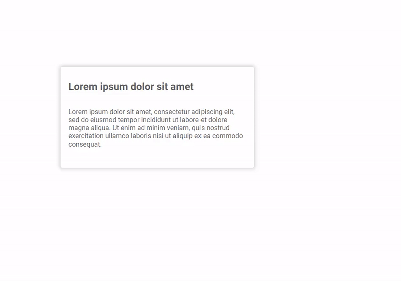

# angular-draggable-resizable
Angular draggable and resizable component
=============

angular-draggable-component is an Angular resizable and draggable component.



Installation
-----------------

To use with node:

```console
npm install angular-draggable-component
```


Usage
-----------------
Import in typescript `module`

```typescript
import { CardModule } from 'angular-draggable-component';

@NgModule({
  declarations: [AppComponent],
  imports: [BrowserModule, CardModule],
  providers: [],
  bootstrap: [AppComponent],
})
export class AppModule {}
```

and then in `html` template

```html
<div style="display: relative; height: 1200px;">
  <ard-card drag resize [width]="'320px'" [height]="'240px'">
    <div>
      <div class="content">
        <h2>Lorem ipsum dolor sit amet</h2>
        <p>
          Lorem ipsum dolor sit amet, consectetur adipiscing elit, sed do
          eiusmod tempor incididunt ut labore et dolore magna aliqua. Ut enim ad
          minim veniam, quis nostrud exercitation ullamco laboris nisi ut
          aliquip ex ea commodo consequat...
        </p>
      </div>
    </div>
  </ard-card>
</div>
```
